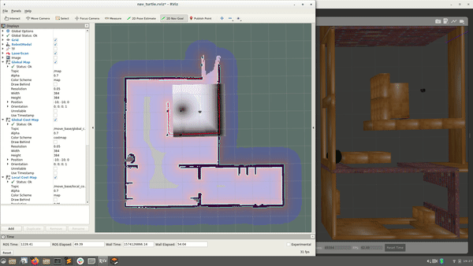

# ME 495: Embedded Systems in Robotics
## Maurice Rahme
## Student ID: 3219435
## Homework 4: turtle_nav package
****
## Image Processing: yolo.launch

This package calls te `usb_cam_node` from the `usb_cam` package as 'cam1'. The `pixel_format` parameter is passed as `yuyv` to mark the colour space. RViz is also launched with a saved configuration that loads and image that reads off the topic `/darknet_ros/detection_image`. This topic is published to by the `darknet_ros` node in the `darknet_ros` package, which is set to read from `/cam1/image_raw` (this is where the `usb_cam_node` publishes the raw image frames) through the `yolo_v3.launch` file, which in turn passes thisparameter to the `darknet_ros.launch` file.

Although the frame rate is low (approximately 0.1Hz), it is noted in the `darknet_ros` documentation that the package is CUDA-optimised, indicating that CPUs are not capable of running it well. The `darknet_ros` node takes the raw image and uses YOLO (You Only Look Once), which is based on the COCO dataset and uses a Convolutionary Neural Network to detect object classes such as persons, buses, cars, etc. In the screenshot below, I am detected as a person. 

## Navigation

After running `source devel/setup.bash` and `catkin_make` in your catkin workspace, run `export TURTLEBOT3_MODEL=burger` to set the turtlebot3 model environment variable to burger. 

To run any of the launchfiles described below, use `roslaunch turtle_nav <launchfile_name.launch>`

### house_turtle.launch

This launchfile starts by defining some arguments for reusability, including `rviz_arg` (loads an RViz config file), `house` (determines whether to use the `turtlebot3_house.launch` file), and `gmap` (determines whether to use the `turtlebot3_slam.launch` file).

First, if the `house` argument is true, the `turtlebot3_house.launch` file is included, with the arguments `model:=burger` and `xpos:=-2.0` to select the desired turtlebot3 version and initial x position respectively. The initial y position is defaulted at 1.0, which is satisfactory. 

Next, the `turtlebot3_teleop_key.launch` file is included to start the keyboard teleoperation node, which allows for controlling the turtlebot using the W A S D keys in the terminal. The `turtlebot3_slam.launch` file is also included with the arguments `slam_methods:=gmapping` and `open_rviz:=false`, which selects the `gmapping` SLAM method and does not load this package's RViz config file. A custom config file is instead loaded in the next line, where the `rviz` node is called. 

This launchfile loads the `turtlebot3_house` world as well as an RViz config file where the currently built map (based on gmapping) can be viewed along with the laser scanner data. If the turtlebot3 is controlled through the keyboard, the map will become more populated as the turtle explores more of the world, provided there are obstacles for the turtle's virtual laser scanner to read. 

#### loc.launch

Using a map saved from teleoperating the turtle in `house_turtle.launch`, the `loc.launch` file calls the former and passes `house:=true`. It also passes to the `rviz` argument to point to its own config file, which loads a local and global cost map, along with a local, global and ROS Nav (from start to finish) path. Next, the `map_server` node is run from the `map_server` package, which reads the `map.yaml`, in the maps directory, which in turn points to the `map.pgm` and identifies its resolution (how many real-world meters per cell) and origin (where the 0,0 index of the map file is in real-world coordinates).

The `amcl.launch` file uses this map to output pose estimates of the turtlebot3 using Adaptive Monte Carlo Localisation. It is passed the arguments `initial_pose_x:=-2.0` and `initial_pose_y:=1.0` to give an initial estimate and calibrate the localisation. An accurate estimate is important in this step. It is also passed the parameters `global_map_frame_id:=map` and `use_map_topic:=true` to ensure that the map from the map server is used for localisation.

The `move_base.launch` file is also loaded with the argument `model:=burger` to allow for placing 2D Nav Goals in RViz that the robot can autonomously move to by avoiding high-cost regions in its local and global cost maps.

The `turtlebot3_remote.launch` file is also included to publish tf data `map -> odom -> base_footprint`, where the transform from `odom -> base_footprint` is subtracted from the robot pose estimate in the `map` frame, making the `map -> base_footprint` the map estimate, where the `map` frame is fixed to the `world` frame. Below is a screenshot of a plan being executed in RViz.

Below is a gif (sped up 4x) of the map being executed with a failure condition near the end (rotate recovery movements).

### remap.launch

This launchfile loads the `loc.launch` file but passes the `house` argument as `false`. Instead, it copies code from the `turtlebot3_house.launch` file but changes the `world_name` argument to spawn a new custom world `remap.world` which should test the turtlebot3's ability to create a new path in the presence of previously unseen local obstacles (with respect to the known loaded map).

Below is a screenshot of a plan being executed along with a re-plan case once a new obstacle becomes identified.

 

Below is a gif (sped up 4x) of the map being executed with the replan case.

### automap.launch
This launcfhile is nearly identical to `house_turtle.launch`, except that it uses its own RViz config file, and the `move_base.launch` file is included to allow the turtlebot3 to move to 2D Nav Goals. Additionally, a custom node `mapper` is loaded. This node uses the move_base action server to send 2D Nav Goals to the turtlebot3 simulated in Gazebo, in order to map the world: turtlebot3_house. The strategy is as follows:

 * First, the map data is collected from the `/map` topic using the `callback_map` subscriber callback function. A random coordinate on the map is then chosen, satisfying three criteria: the coordinate must be un-obstructed (cell value < 0.196), it must have at least one neighbouring cell (including diagonals) that is unmapped (cell value -1), and can have no more than one neighbour cell be an obstacle (cell value > 0.65).

 * Upon finding a map coordinate which satisfies these criteria, a 2D Nav Goal is sent to the `move_base` action server to command the turtlebot3 to move to that point. The `gmapping` node will cause the turtlebot3 to map the environment as it moves. The next 2D Nav Goal is given when a `terminal status` is returned from the `move_base` action server (goal reached, goal aborted, etc).

 Below is a gif (sped up 8x) of the autonomous mapping using this launchfile:

 

 Below is the map generated after executing for 7 minutes:

 